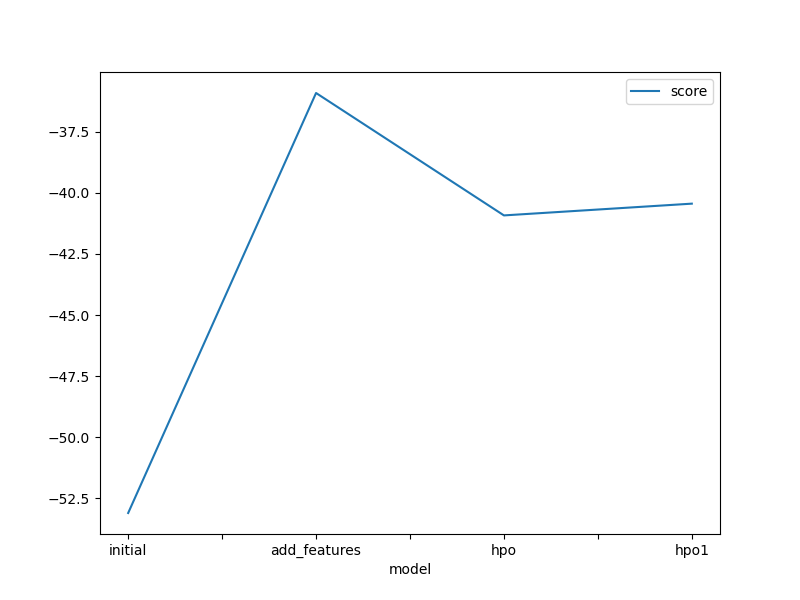
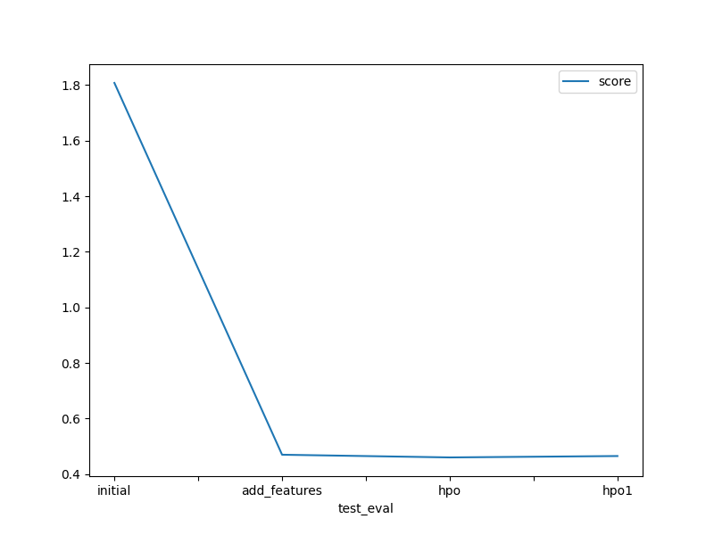

# Report: Predict Bike Sharing Demand with AutoGluon Solution
#### MONTASSAR BEN DHIFALLAH

## Initial Training
### What did you realize when you tried to submit your predictions? What changes were needed to the output of the predictor to submit your results?
TODO: I observed that predictions has some negative RMSE values.We now know that if we don't set everything to be bigger than 0, Kaggle will reject the prediction.
To deal with this situation, I first counted the number of negative score predictions the predictor returned before setting all of the negative predictions to 0. 
I assign those predictions to the submission dataframe at the end.

### What was the top ranked model that performed?
TODO: 

## Exploratory data analysis and feature creation
### What did the exploratory analysis find and how did you add additional features?
TODO: Add your explanation

### How much better did your model preform after adding additional features and why do you think that is?
TODO: Add your explanation

## Hyper parameter tuning
### How much better did your model preform after trying different hyper parameters?
TODO: Add your explanation

### If you were given more time with this dataset, where do you think you would spend more time?
TODO: Add your explanation

### Create a table with the models you ran, the hyperparameters modified, and the kaggle score.
|model|time|num_boost_round|num_epochs|score|
|--|--|--|--|--|
|initial|600|default|default|1.80785|
|add_features|600|default|default|0.46979|
|hpo|600|100|10|0.46006|
|hpo2|900|120|15|0.46505|

### Create a line plot showing the top model score for the three (or more) training runs during the project.

TODO: Replace the image below with your own.

### Create a line plot showing the top kaggle score for the three (or more) prediction submissions during the project.

TODO: Replace the image below with your own.

## Summary
TODO: I worked on predicting bike sharing demand with a regression model based on historical data.
I did an exploratory data analysis for the used dataset. Then, I performed feature engineering by creating new features. 
After that, I trained different regression models
